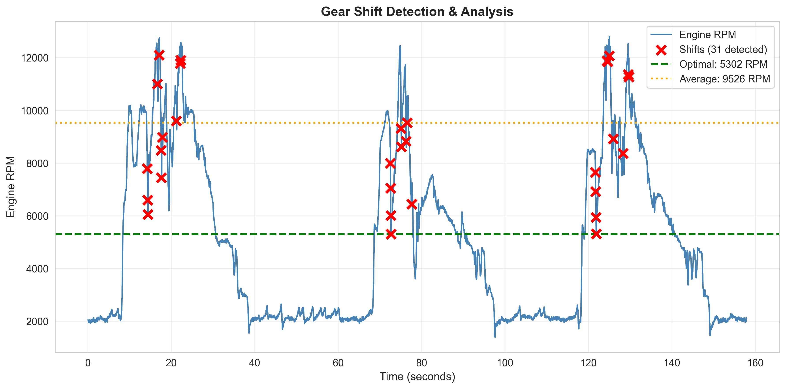
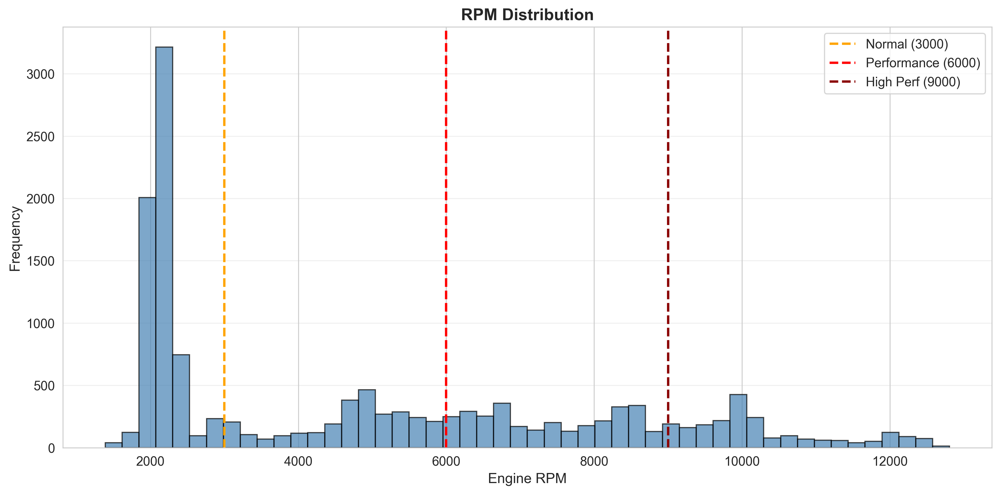
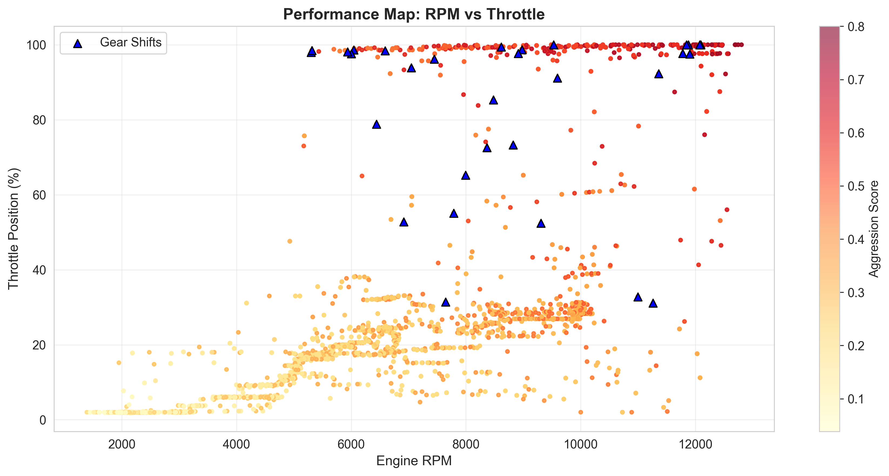
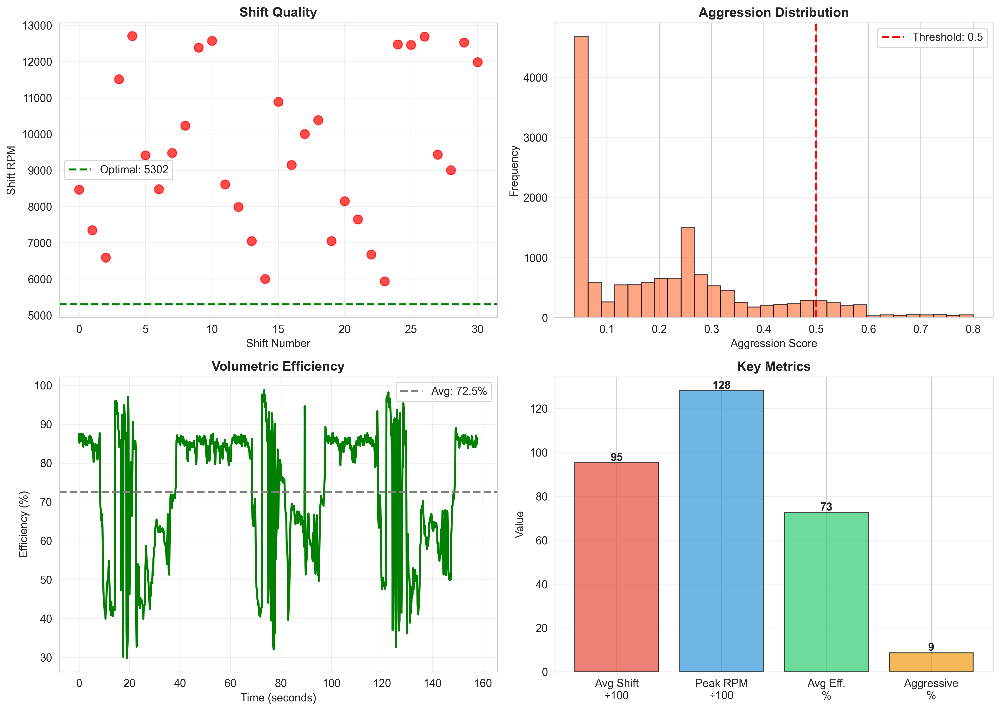

# DFR--Onboarding-Project

### Technologies Used: Python3, pandas, numpy, matplotlib, seaborn

## Step 1: Data Cleaning:

### Steps:
- Converted the timestampls from UNIX format to datetime
- Removed incomplete rows: dropped missing rows from the engine data (RPM, TPS, MAP, Lambda)
- Removed rows there RPM = 0 (Invalid data)
- Forward-filled gaps: Filled remaining missing values

### Results:
- Before cleaning: 14372 rows
- After cleaning: 14366 rows
- Only removed 6 rows (0.04% of the data)

## Step 2: Insights:
### 1. Volumetric Efficiency
- Measures how efficiently the engine is able to fill its cylinders with air
- The formula is: `(MAP / Barometric Pressure)  * 100`
#### Results: 
- Average efficiency: **72.55%**
- Peak efficiency: **98.71%**
- The data shows that the engine is breathing well, with a peak efficiency approaching 100%, indicating good air intake
## 2. Acceleration Detection
**What it is:** Identifies moments of hard acceleration.

**Formula:** `RPM increase > 100` AND `throttle > 50%`

**Results:**
- Detected **180 acceleration events**
- Time accelerating: **1.3% of session**

**Interpretation:** Driver uses minimal full-throttle time, suggesting conservative driving
  ## 3. Gear Shift Detection 
**What it is:** Automatically detects every gear shift by finding sharp RPM drops while throttle is open.

**Formula:** Detect `RPM drop > 500` while `throttle > 30%`

**Results:**
- Detected **31 gear shifts** automatically
- Average RPM drop: **-743 RPM**
- Shift range: **5,302 - 12,096 RPM**
- Average shift point: **9,526 RPM**
- Optimal shift point: **5,302 RPM**

**Key Finding:** **Driver is shifting 4,224 RPM too early!**

**Impact:** By shifting closer to redline, the driver could:
- Stay in the power band longer
- Achieve faster acceleration
- Improve lap times significantly

- ## 4. Driving Aggression Score 
**What it is:** A composite metric that combines multiple factors to quantify driving intensity.

**Formula:** Weighted combination of:
- Throttle position (30%)
- Throttle change rate (20%)
- RPM level (30%)
- Boost build rate (20%)

**Results:**
- Average aggression: **0.244**
- Peak aggression: **1.289**
- Driving style breakdown:
  - Smooth: **73.6%**
  - Moderate: **20.9%**
  - Aggressive: **5.5%**
 **Assessment:** **CONSERVATIVE driver**

## Step 3. Data/Graphs
## Graph 1: Gear Shift Detection & Analysis

**Type:** Line graph with scatter overlay

**Shows:**
- Blue line: RPM over time
- Red X markers: Detected gear shifts
- Green dashed line: Optimal shift point
- Orange dotted line: Actual average shift point

**Key Insight:** Clear visual showing driver consistently shifts below optimal point, leaving performance untapped.

## Graph 2: RPM Distribution

**Type:** Histogram

**Shows:**
- Frequency distribution of engine RPM
- Vertical lines marking driving zones (3000, 6000, 9000 RPM)

**Key Insight:** Bimodal distribution shows two distinct operating modes: cruising (2,000-4,000 RPM) and performance runs (7,000-8,000 RPM).

## Graph 3: Performance Map

**Type:** Scatter plot with color gradient

**Shows:**
- X-axis: Engine RPM
- Y-axis: Throttle position
- Color: Aggression score (yellow = smooth, red = aggressive)
- Blue triangles: Gear shift locations

**Key Insight:** Clear clustering shows distinct operating zones. Most aggressive moments occur at high RPM + high throttle, as expected.

## Graph 4: Summary Dashboard

**Type:** Multi-panel dashboard (4 subplots)

**Shows:**
1. **Top-left:** Shift quality - actual vs optimal
2. **Top-right:** Aggression distribution histogram
3. **Bottom-left:** Volumetric efficiency over time
4. **Bottom-right:** Key metrics summary bar chart

